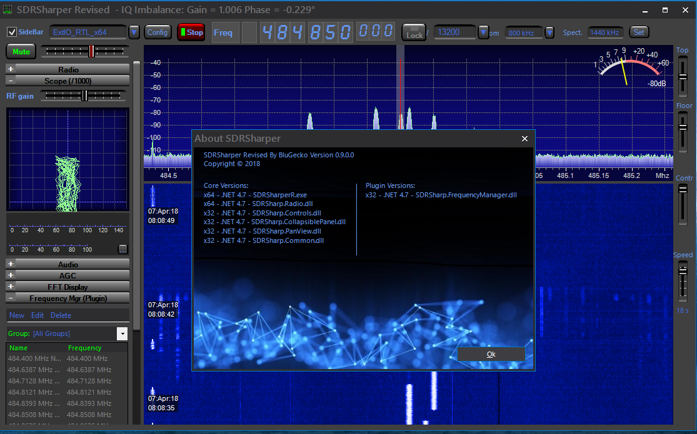

# SDRSharper Full Source (VS2017)
<h3>Build Order:</h3>
	Radio 
  Controls 
	PanView 
	Common 
	CollapsiblePanel 
	SDRSharper - Don't forget to check your references to the above.  
	NOTE: This solution will require Telerik RadForms. However, it can be easily converted back to winforms. Other changes made were converting 'int' to 'int32', a bug in the audiogram which caused crashing, and also updated to C# latest/.NET 4.7. Solution will compile for both x32/x64bit builds, changed a few colors. Added autochecking for x32/x64 PortAudio and EXT_IO. You can place both verions in the same folder without conflicts. Fixed some nasty bugs that occured on opening/closing. Some error checking while loading plugins. So it runs pretty stable now, but there is still a bug in initial play... start/stop/then start again. I prefer this over SDRSharp and maybe HDSDR. Nice!
  
Have fun experimenting with SDRSharper v0.L6 source! 
Orignal binaries <a href="http://www.qsl.net/s/sdr/">HERE</a>
 
TODO: Add direct support for P25 ;) 
 
 
 
Stay tuned for further releases... Upcoming... UniTrunker (mainly for trunking) and DSDplus (mainly since they dont want to release unless your 'Fastlane', 6 months my ass)!! Just cleaning it up for successful compile. ;)
